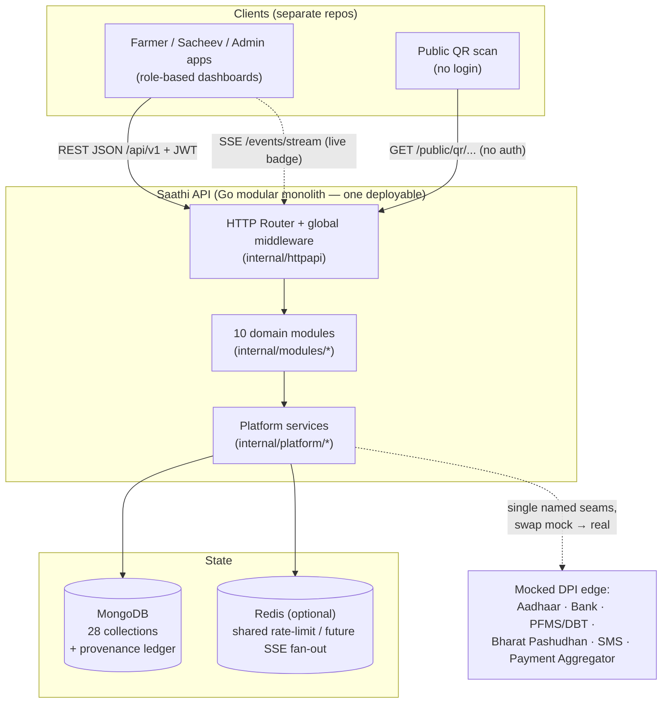
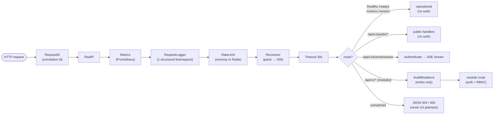
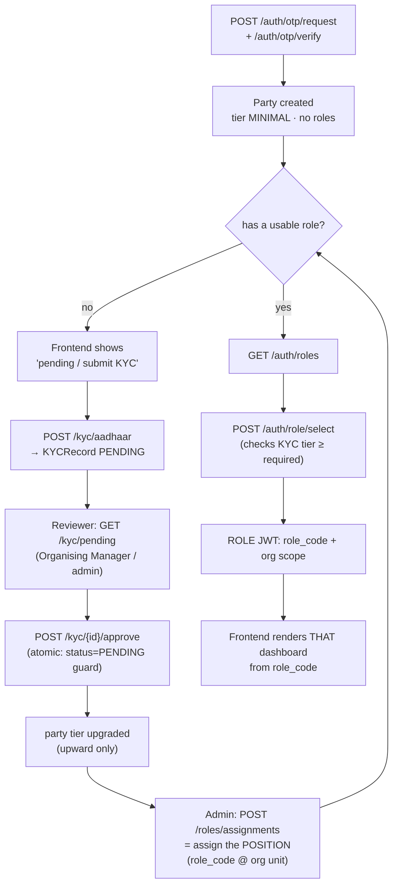
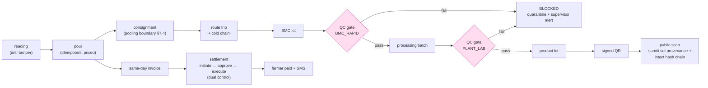
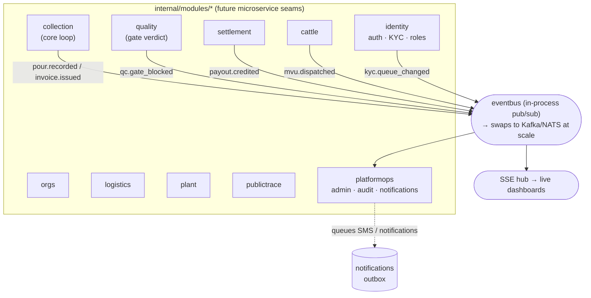
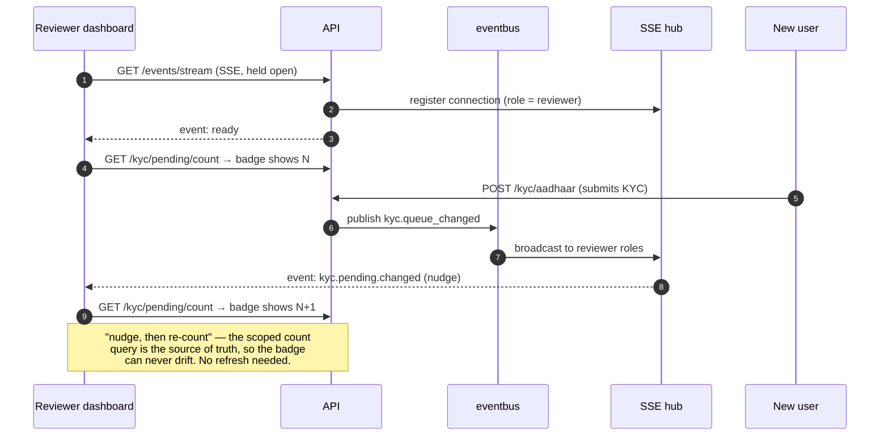
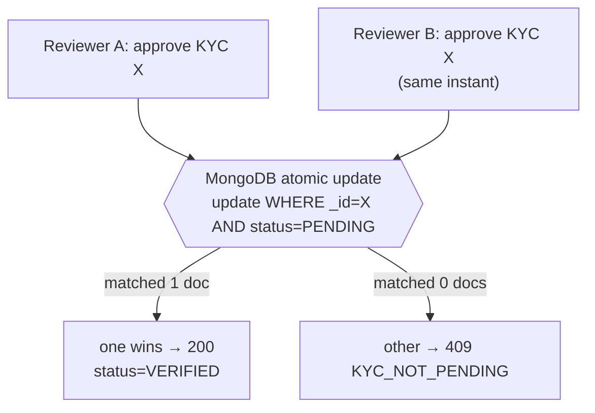
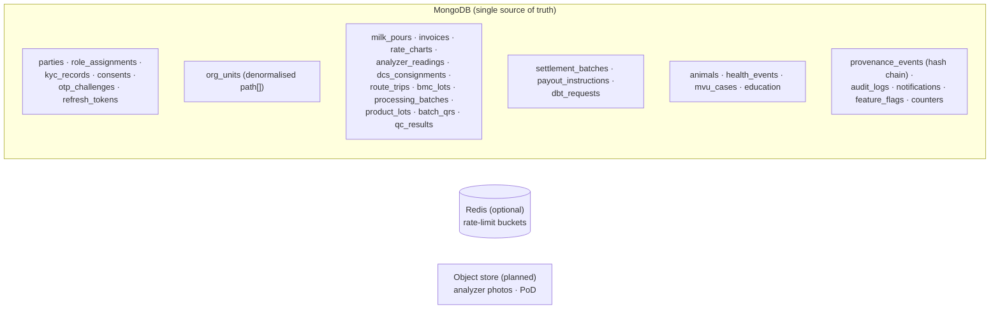

# Saathi Backend — How It Works (Flow Diagrams)

> **Purpose:** a visual map of how the backend behaves *right now*, so you can review it, spot gaps,
> and decide where to intervene. Every diagram reflects the actual code in `internal/` and `cmd/`.
> Companion docs: [`strict_brief.md`](strict_brief.md) (per-endpoint contract),
> [`WORKFLOW_GUIDE.md`](WORKFLOW_GUIDE.md) (role flows), [`TECHNICAL_NOTES.md`](TECHNICAL_NOTES.md)
> (architecture decisions).
>
> Diagrams are Mermaid — they render in GitHub, GitLab and VS Code.

---

## 1. The whole system at a glance



**Read this as:** clients hit one Go service over REST (+ an SSE stream for live updates); the service
is internally split into 10 isolated modules over shared platform services; all state lives in MongoDB
(Redis is optional, only for cross-replica concerns); external gov systems sit behind mock seams.

---

## 2. The global request pipeline (every request passes through this)

Order is exactly as wired in `internal/httpapi/router.go`.



Key facts to note for analysis:
- **Rate limiting runs before auth** (cheap abuse protection). It's per-IP; `REDIS_URL` makes it shared across replicas.
- **AuditMutations** wraps every state-changing `/api/v1` call — the immutable who-did-what trail.
- **Public routes and the operational endpoints deliberately skip authentication.**
- A single `request_id` threads through the request log and every module log line — that's how you trace one request end-to-end.

---

## 3. Inside a request — the layered flow (handler → service → repo)

Every module follows the same four-file contract. Example: recording a milk pour.

```mermaid
sequenceDiagram
    autonumber
    participant C as Client
    participant MW as Middleware<br/>(auth + RBAC)
    participant H as handler.go<br/>(HTTP only)
    participant S as service.go<br/>(business logic)
    participant R as repo.go<br/>(Mongo only)
    participant L as Ledger / Bus / Audit
    participant DB as MongoDB

    C->>MW: POST /api/v1/collection/pours + role JWT
    MW->>MW: verify token → Actor on ctx;<br/>RequireRoles(SACHEEV, MILK_TESTER)
    MW->>H: (authorised)
    H->>H: decode JSON, parse ObjectIDs (httpx)
    H->>S: CreatePour(ctx, actor, req)
    S->>S: RequireInScope(dcs) · farmer is member? ·<br/>price via rate chart · plausibility gate
    S->>R: idempotency check (client_event_id)
    R->>DB: findOne / insert
    S->>L: append pour.recorded · publish bus · queue SMS
    L->>DB: provenance event (hash-chained)
    S-->>H: pour struct or *AppError
    H-->>C: JSON envelope {data:...} or {error:...}
```

The rule the whole codebase obeys: **handlers do HTTP, services do logic, repos do Mongo, and modules
never import each other** — cross-module effects go through the event bus.

---

## 4. Identity: login → KYC approval → position → dashboard

This is the onboarding spine (the "which UI does the user get" question).



Analysis hooks:
- A role token is **only** issuable once KYC tier satisfies the role (`403 KYC_TIER_INSUFFICIENT` before approval).
- Position = a `RoleAssignment` row (not a field on the user), so one human can hold several and switch.
- **Open question flagged earlier:** a brand-new party with no assignment is only visible to federation-wide reviewers (Super Admin / PCDF Admin), not a scoped Organising Manager — first-touch KYC routing is a product decision.

---

## 5. The core milk loop (pour → QR → payment) with the safety gate



Every box appends a provenance event; a `BLOCKED` subject can never advance (dispatch/batch/product/QR all re-check). FSSAI limits (AFM1 ≤ 0.5 µg/kg, coliform ≤ 10 CFU/ml, phosphatase negative) are enforced in `domain/quality.go`.

---

## 6. Module map + how modules talk (event bus, never direct)



Modules read shared services from one `deps.Deps` container: `JWT, Ledger, Audit, Flags, Orgs, Bus, SSE, RateLimiter, DB, Cfg, Log`.

---

## 7. Real-time: the live "pending KYC" badge (SSE)



Today the hub fans out within one process. At multi-replica scale the broadcast swaps to Redis pub/sub — no route changes.

---

## 8. Concurrency: "two at once → only one wins" (no Redis lock)



The state check lives **inside** the update filter, so the check-and-write is one indivisible operation.
Same pattern guards settlement `execute` (with a resume lease) and the BMC-lot→batch claim
(`DISPATCHED → POOLED`, so one lot can't feed two batches). This is safer than a Redis lock — one
source of truth, no lock-vs-DB drift. Proven by smoke step 22 (`200` + `409`).

---

## 9. Data stores (what lives where)



Every `_id` is an ObjectID; every cross-collection reference is an ObjectID (native `$lookup`/populate).
Human-readable keys (`phone`, `code`, `qr_code`, `invoice_number`, `pashu_aadhaar`) are separate unique
indexes. The `provenance_events` collection is append-only and hash-chained.

---

## 10. Where to intervene — analysis checklist

Points a human reviewer should weigh (honest current state):

| Area | Current state | Decision / next step |
|---|---|---|
| **Deployment** | single modular monolith, stateless | scale = N replicas + Mongo replica-set/shard; split a module out only when a bottleneck is measured |
| **Real-time** | SSE within one process | add Redis pub/sub for cross-replica fan-out when >1 replica |
| **Rate limiting** | in-process default; Redis when `REDIS_URL` set | turn on Redis in prod (compose already wired) |
| **First-touch KYC routing** | scoped reviewers can't see assignment-less new parties | product decision: auto-route new KYC to a district queue? |
| **External DPI** | all mocked behind named seams | wire real Aadhaar / bank / PFMS / Bharat Pashudhan / SMS / PA one seam at a time |
| **Notifications** | outbox + manual worker endpoint | move worker to cron/queue; add real SMS provider |
| **Object store** | `photo_object_key` fields exist, no upload endpoint | add S3-compatible presigned upload |
| **Multi-doc invariants** | safe via atomic guards + unique indexes | optional Mongo transactions (needs replica set) to tighten crash windows |
| **Observability** | structured logs + Prometheus metrics + health/ready | add OpenTelemetry tracing when microservices land |
| **CI/CD, IaC, K8s** | Dockerfile + compose only | add pipeline + manifests before go-live |

---

### One-command reality check
`make smoke` runs the entire flow above (23 asserted steps: pour → gate → QR → settlement → KYC
approval → concurrency proof → live SSE badge) against a scratch MongoDB. If it's green, this diagram is true.

---

## 11. Release 26.07.02 additions (2026-07 — store-note alignment)

New fields and behaviour layered on top of the flow above. All additive; no
existing field was removed.

### 11.1 Onboarding case — richer doorstep KYC capture
`onboarding_cases` (and the submit request) now carry, alongside the existing
identity fields:

| Field (bson) | Meaning |
|---|---|
| `father_husband_name` | पिता/पति का नाम — **required for farmers** at the FE; captured on the govt notice प्रारूप |
| `mother_name` | माता का नाम (optional) |
| `admin_hierarchy` | geo-tapped + executive-confirmed address chain: `village → gram_panchayat → block → tehsil → district (janpad) → mandal → state` |

- Domain: `internal/domain/onboarding.go` (`AdminHierarchy` struct + the two name
  fields on the case).
- Wire: `internal/modules/onboarding/models.go` (request) → `service.go` passthrough.
- Stored verbatim for the reviewer console; the **approval saga still only needs**
  phone / full_name / requested_role / org_unit_id / requested_tier — these are
  display/record fields, they do not change grant logic.
- The Super Admin verify screen renders the full set (incl. Aadhaar number and
  the KYC + profile photos) so a reviewer sees everything the executive captured.

### 11.2 Animal registry — the farmer's name for the animal
`animals` gains an optional `name` (e.g. "Lakshmi") set at `POST /cattle/animals`.
The 12-digit **Pashu Aadhaar ear-tag stays the unique key** (409 on duplicate);
`name` is a human label only. Farmers self-register (the route already admits
`RoleFarmer` plus Sachiv/LRP/AI-tech/vet on a farmer's behalf).

### 11.3 Settlement — Union (Sangh) approval + payments are display-only
- **Adhyaksh retired from money authority.** Settlement approve/reject is now
  `RoleUnionPresident` only (was Adhyaksh **or** Union). Dual control is
  unchanged: initiator ≠ approver still enforced in the service.
- **Settlement WRITE routes are disabled for the store-submission posture**
  (`internal/modules/settlement/module.go`): `POST /settlements` (initiate),
  `/{id}/approve`, `/{id}/reject`, `/{id}/execute` are **commented out with a
  revival note** — uncomment to re-enable the full Mode-2 flow later. The
  **read** routes stay live (`GET /settlements`, `GET /settlements/payouts`), so
  the app shows payments as **earned amounts + history** (pour → invoice →
  accrual) without any in-app approval step. Money movement happens outside the
  app for now.

### 11.4 QR trace resilience + fail-closed consumer gate (already live)
- `publictrace` batch-code scans **survive a QR-secret rotation / secret drift**:
  a scan by the full batch code always serves (drift is logged as an ops
  warning); only short `/t/<token>` refs remain strictly verified
  (`classifyBatchQRScan`). Fixes the "two deployments sharing one DB re-sign each
  other's tokens" 404 storm.
- `consumer` traceability + `/label` gate (`appKeyOK`) is **fail-closed**: an
  unset `CONSUMER_APP_KEY` denies everyone (403) instead of opening the bridge.
- `qrresign.go` boot backfill re-signs stored QR tokens after a secret change so
  existing QRs keep resolving.
