# Saathi — Roles & Complete Workflow Guide

> **Who does what, in what order, through which APIs.** This is the operational companion to
> [`TECHNICAL_NOTES.md`](TECHNICAL_NOTES.md) (architecture) and the blueprint PDF (product spec).
> All diagrams are Mermaid — GitHub/GitLab/VS Code render them inline.
>
> One rule powers everything: **one phone number = one Party = many org-scoped roles.** The same
> human can be a Farmer *and* the Samiti Sacheev; they log in once and switch roles in-app.

---

## 1. The big picture — milk's journey from cow to QR scan

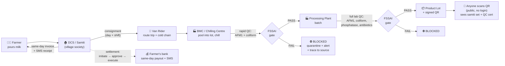

Every arrow above appends an **immutable, hash-chained provenance event** — the public scan
re-verifies the chain and shows `ledger.intact: true`.

---

## 2. The cooperative hierarchy (where every role lives)

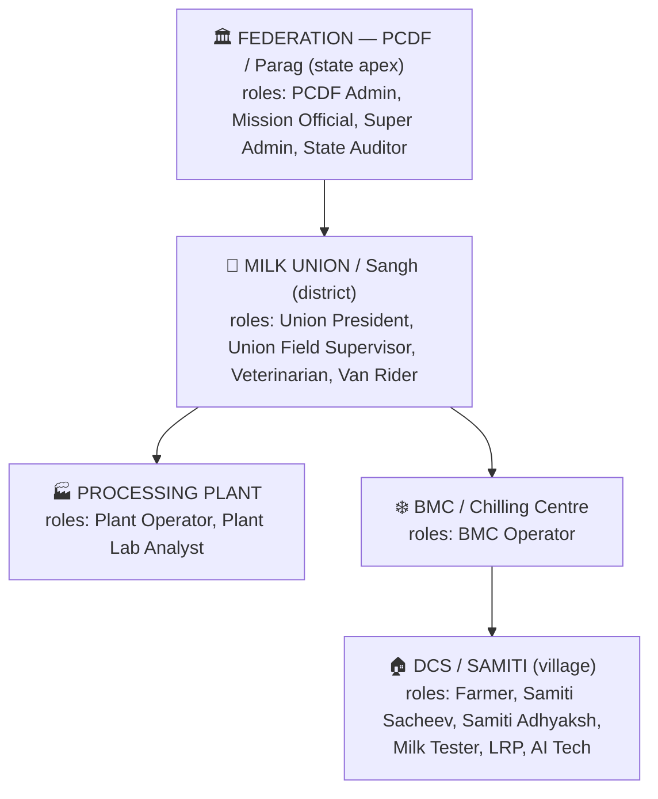

A role is always granted **at** one of these org units, and its powers stop at that unit's
subtree (enforced by `RequireInScope` on every API). A Union President sees their district;
a Sacheev sees only their samiti; Super Admin and State Auditor see everything (all audited).

---

## 3. Role-by-role: who they are and what they do

### 🏠 Village tier (the samiti)

| Role | Real person | What they do in Saathi | Key APIs |
|---|---|---|---|
| **FARMER** (Dugdh Utpadak) | Milk producer | Sees own pours, today's bill, payment history, own cattle; requests 1962 vet; applies KYC | `GET /collection/pours` `GET /collection/invoices` `GET /settlements/payouts` `POST /cattle/mvu-cases` `POST /kyc/aadhaar` |
| **SAMITI_SACHEEV** (DCS Secretary) | Runs the collection counter | Records readings + pours (works offline), generates same-day invoices, seals the consignment, **initiates** settlement | `POST /collection/readings` `POST /collection/pours` `POST /collection/pours/batch-sync` `POST /collection/invoices/generate` `POST /logistics/consignments` `…/dispatch` `POST /settlements` |
| **SAMITI_ADHYAKSH** (DCS Chairman, elected) | Governance co-sign | **Approves/rejects** settlements (dual control — can never approve one they initiated), grants FARMER/tester roles in own samiti | `POST /settlements/{id}/approve` `/reject` `POST /roles/assignments` |
| **MILK_TESTER** | Fat/quality tester | Same collection console as Sacheev (readings + pours) | `POST /collection/readings` `POST /collection/pours` |
| **LRP** | NDDB village extension worker | Assists onboarding, registers animals | `POST /cattle/animals` |
| **AI_TECH** | Artificial-insemination tech | Logs AI/breeding events against Pashu Aadhaar → syncs to Bharat Pashudhan | `POST /cattle/animals/{id}/health-events` |

### 🧑‍🏫 Field / organisation tier

| Role | Real person | What they do in Saathi | Key APIs |
|---|---|---|---|
| **ORGANISING_MANAGER** | Ground-level field worker (Dairy Development Dept pattern — "promotes and organises new samitis") | **Does doorstep KYC and approves it**, then **decides the user's position** by granting a role. This is the human gate between "someone signed up" and "someone can log in as a Farmer/Sacheev/etc." | `GET /kyc/pending` `POST /kyc/{id}/approve` `POST /kyc/{id}/reject` `POST /roles/assignments` |

### 🚐 Logistics tier

| Role | What they do | Key APIs |
|---|---|---|
| **VAN_RIDER** | Picks up consignments DCS-by-DCS, logs temperature at pickup + in transit, delivers to BMC | `POST /logistics/trips` `…/stops/{cid}/pickup` `…/cold-chain` `…/deliver` |
| **DELIVERY_RIDER** | Last-mile consumer delivery — **descoped for now** (Phase 3) | — |

### 🏭 Union / plant tier

| Role | What they do | Key APIs |
|---|---|---|
| **BMC_OPERATOR** | Pools delivered consignments into a lot, logs chilling temp, runs **rapid QC strips** (AFM1 + coliform), dispatches passed lots to plant | `POST /plant/bmc-lots` `…/close` `POST /quality/qc-results` (stage `BMC_RAPID`) `…/dispatch` |
| **UNION_FIELD_SUPERVISOR** | Oversees a cluster of DCS+BMCs, reviews anomaly-flagged readings, receives **safety-block alerts** | `GET /collection/readings` `GET /logistics/*` (scoped reads) |
| **UNION_PRESIDENT** | District oversight, approves rates, grants union-tier roles | `POST /collection/rate-charts` `POST /roles/assignments` |
| **PLANT_OPERATOR** | Creates processing batches from **passed** BMC lots, completes batches, creates product lots, issues QRs | `POST /plant/batches` `…/complete` `POST /plant/product-lots` `POST /plant/qrs` |
| **PLANT_LAB_ANALYST** | Full lab QC (ELISA/HPLC AFM1, culture coliform, phosphatase, antibiotics) — the **plant gate**; can recall product lots | `POST /quality/qc-results` (stage `PLANT_LAB`) `POST /plant/product-lots/{id}/recall` |

### 🏛 State / district / health tier

| Role | What they do | Key APIs |
|---|---|---|
| **PCDF_ADMIN** | Federation config: org tree, rate policy, education content, DBT | `POST /orgs` `POST /collection/rate-charts` `POST /dbt/requests` |
| **MISSION_OFFICIAL** | Nand Baba Mission oversight: DBT/subsidy status, trace tools, dashboards | `POST /dbt/requests` `GET /trace/*` |
| **DISTRICT_VERIFIER** | Verifies scheme applications (Phase 2 surface) | — |
| **VETERINARIAN** | 1962 MVU vet: case dispatch/close, health events, e-prescriptions, Bharat Pashudhan push | `POST /cattle/mvu-cases/{id}/dispatch` `/close` `POST /cattle/animals/{id}/health-events` `…/bp-sync` |
| **MVU_DRIVER** | MVU ambulance dispatch/route | `POST /cattle/mvu-cases/{id}/dispatch` |

### ⚙️ Platform tier

| Role | What they do | Key APIs |
|---|---|---|
| **SUPER_ADMIN** | Break-glass admin: feature flags, any role grant, full access — **every action audited** | `PUT /admin/flags/{key}` `POST /roles/assignments` |
| **STATE_AUDITOR** | Read-only everywhere + immutable audit-log export | `GET /audit/logs` `…/export` `GET /trace/*` |
| **SUPPORT_AGENT** | Helpdesk: limited PII lookup (each lookup itself audit-logged) | `GET /support/parties/lookup` |
| **SERVICE_ACCOUNT** | Machines (AMCU devices, connectors) — e.g. the dormant collar telemetry endpoint | `POST /cattle/telemetry` (403 until flag flips) |
| **CONSUMER** | **Descoped** — no consumer accounts. The public QR scan needs no login at all. | `GET /public/qr/{code}` (public) |

---

## 4. Flow 1 — Onboarding & the role switcher (§4)

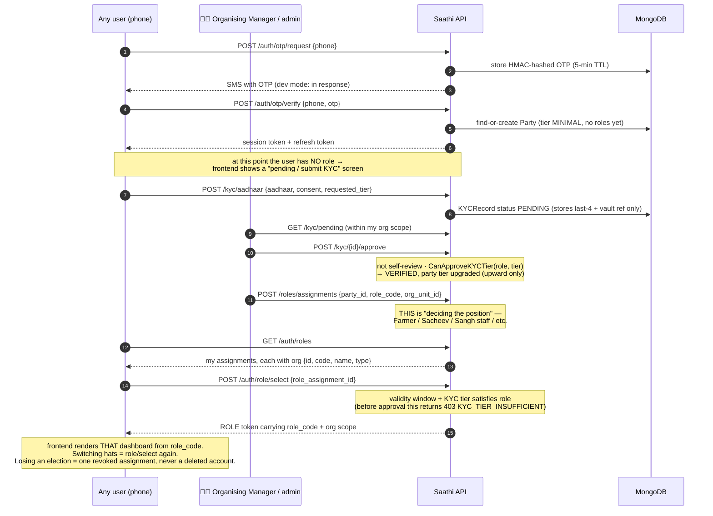

**The position is stored as the `RoleAssignment`** (`role_code` + `org_unit_id`), not a field on the
user — because one human can hold several (a Sacheev *is also* a Farmer). The role token's
`role_code` is the single value the frontend switches on to pick the dashboard; the assignment's
ObjectID is the lookup/revocation handle.

---

## 5. Flow 2 — A morning at the samiti: pour → receipt → same-day invoice (§8.1, §8.2)

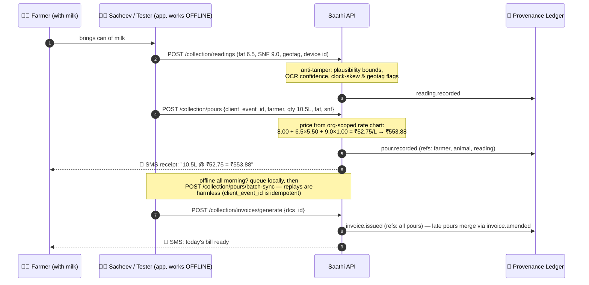

---

## 6. Flow 3 — Same-day money: the dual-control settlement (§8.1 guardrail)

**Saathi computes and initiates. A different human approves. A licensed PA executes. Money never moves autonomously.**

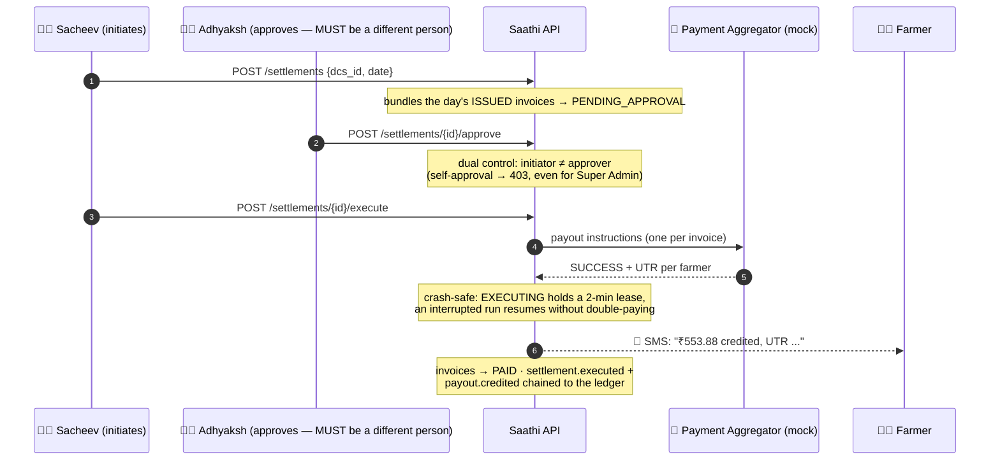

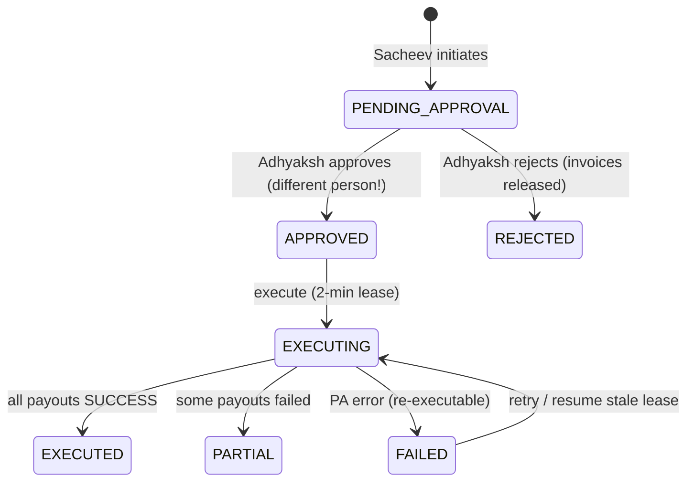

---

## 7. Flow 4 — The milk's physical journey: consignment → van → BMC (§7.1)

```mermaid
sequenceDiagram
    autonumber
    participant S as 🧑‍💼 Sacheev
    participant R as 🚐 Van Rider
    participant B as ❄️ BMC Operator
    participant API as Saathi API
    participant L as 🔗 Ledger

    S->>API: POST /logistics/consignments {dcs, date, shift}
    Note over API: aggregates the shift's pours — this is the<br/>POOLING BOUNDARY: past here milk traces to a<br/>SET of samitis, never one farmer (§7.4)
    API->>L: consignment.created (refs: pours)
    S->>API: POST .../dispatch (seals it; late pours now 409)
    R->>API: POST /logistics/trips {route, stops:[{dcs, consignment}]}
    R->>API: POST .../stops/{cid}/pickup {temp_c: 4.2}
    API->>L: consignment.picked_up
    R->>API: POST .../cold-chain {temp_c} (repeat en route)
    R->>API: POST .../deliver {bmc_id}
    API->>L: trip.delivered
    B->>API: POST /plant/bmc-lots {consignment_ids} → pool into lot
    B->>API: POST .../close {chilling_temp_c: 3.8} → QC_PENDING
```

---

## 8. Flow 5 — The FSSAI safety gate: the heart of "disease-free milk" (§8.3)

**Why it's shaped this way:** Aflatoxin M1 survives pasteurisation. If it isn't caught at the
BMC/plant, it ends up in the packet. So the gate fires **twice**, and a failed subject is
physically unable to advance through the API.

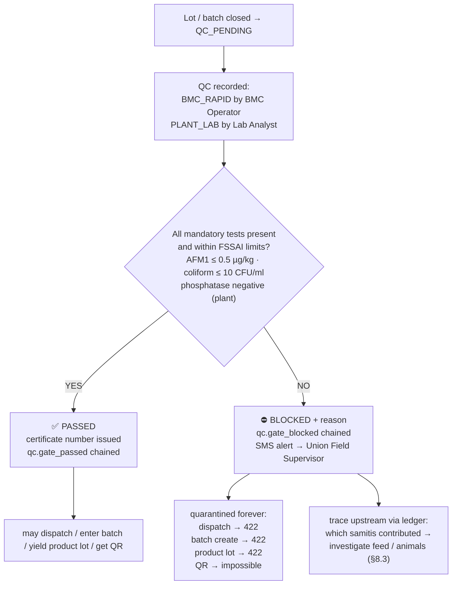

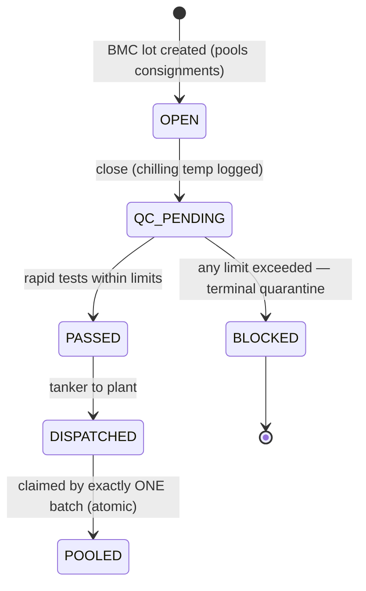

Gate hardening (post-review): unknown test names are rejected, a PASS requires the complete
mandatory test set per stage, evidence + ledger events are persisted **before** the status flips,
and one lot can never feed two batches.

---

## 9. Flow 6 — Plant: batch → product lot → signed QR → public scan (§8.4)

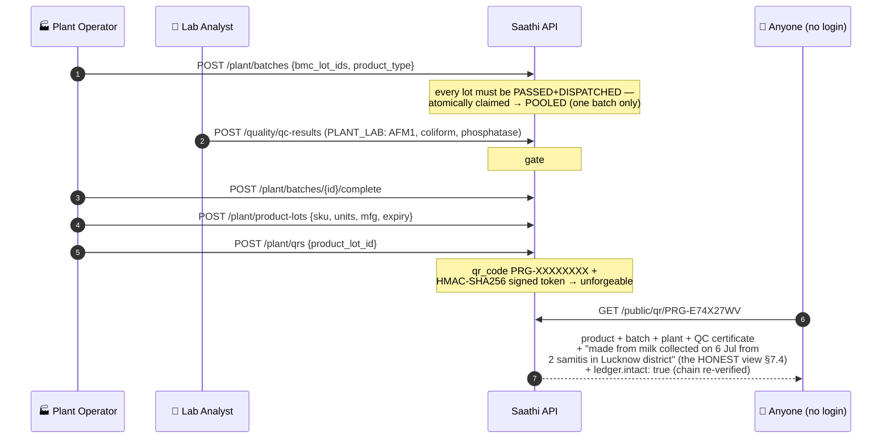

The scan never claims per-farmer origin — pooled milk traces to the **set of contributing
samitis**, and the API is built so it *cannot* say otherwise.

---

## 10. Flow 7 — Cattle health & 1962 MVU (§9, §10)

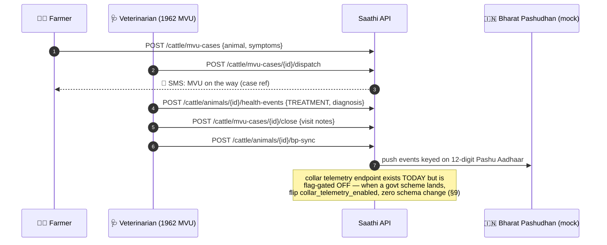

---

## 11. Flow 8 — Admin, auditor & the control tower (§12)

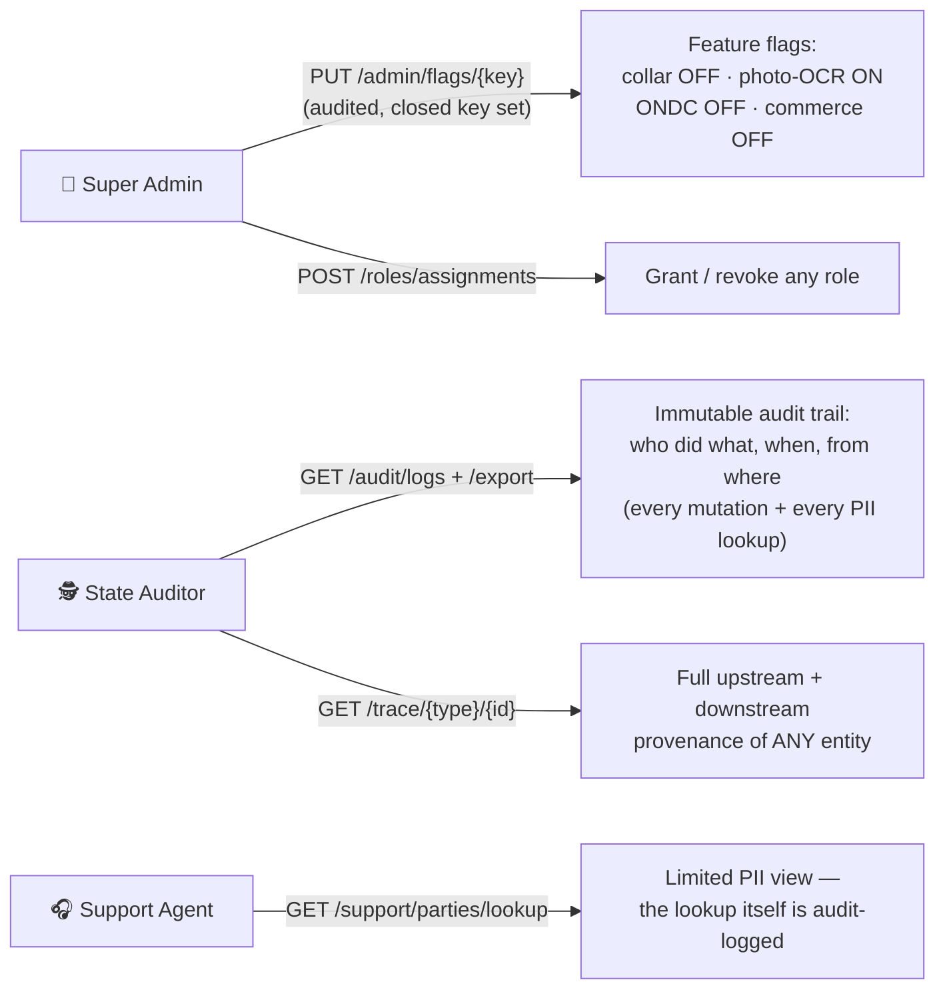

---

## 12. Quick RBAC cheat-sheet (who can hit what)

| Action | Allowed roles |
|---|---|
| Record reading / pour | Sacheev, Milk Tester |
| Generate invoices | Sacheev |
| Create/dispatch consignment | Sacheev |
| Run trip / pickup / deliver | Van Rider (only their own trip) |
| Create/close/dispatch BMC lot | BMC Operator |
| QC at BMC (`BMC_RAPID`) | BMC Operator |
| QC at plant (`PLANT_LAB`) | Plant Lab Analyst |
| Create batch / product lot / QR | Plant Operator (QR also Lab Analyst) |
| Recall product lot | PCDF Admin, Lab Analyst |
| Initiate settlement | Sacheev |
| Approve settlement | Adhyaksh, Union President (never the initiator) |
| Rate charts | PCDF Admin, Union President |
| Org tree | Super Admin, PCDF Admin |
| Review / approve KYC | Organising Manager, District Verifier, PCDF Admin, Super Admin (each within their scope + tier) |
| Role grants ("assign position") | Super Admin, PCDF Admin, Union President (their tiers), Adhyaksh (farmers in own DCS), Organising Manager (Farmer/Consumer in scope) |
| DBT subsidy | Mission Official, PCDF Admin |
| Feature flags | Super Admin |
| Audit logs / export | State Auditor, Super Admin |
| Public QR scan / ledger verify | **anyone — no login** |

Plus, always: **Super Admin bypasses role gates (fully audited)** and **every write is
org-scope-checked** — your role only works inside your own subtree of the cooperative.

---

## 13. Try the whole story locally in one command

```bash
make smoke
```

That script is this document executed: it logs in as each role above and drives
pour → receipt → invoice → consignment → trip → BMC → gate (pass **and** blocked paths) →
batch → QR → public scan → dual-control settlement → SMS worker — 20 steps, all asserted.
